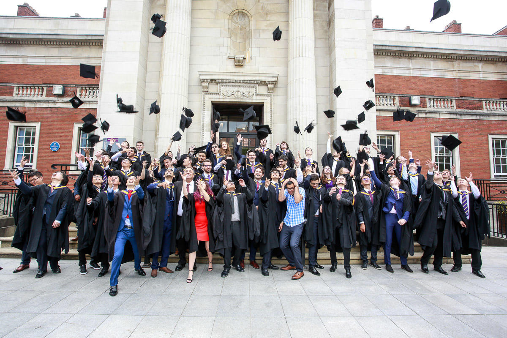

# Recruiting our Students {#recruitment}
Many of our students are recruited _before_ they graduate by working for an employer on a fixed-term contract, either as a summer internsh or a year long placement program.

```{r graduating-your-fig, echo = FALSE, fig.align = "center", out.width = "100%", fig.cap = "(ref:captiongradceremony)"}

```

(ref:captiongradceremony) Are these graduates the future of your organisation? If you want them to be, you need to engage early and often with students *before* they graduate. This will increase your chances of recruiting them. The picture shows University of Manchester graduates celebrating their graduation outside the [Samuel Alexander](https://en.wikipedia.org/wiki/Samuel_Alexander) building with photobombing by [Gavin Brown](https://profgavinbrown.github.io/) 🎓


## About our students {#students}

We are one of the biggest department of Computer Science at the [Russel Group](https://www.russellgroup.ac.uk/) with a lots of students. As of 2024/5 we have around: 

* ~1200 students studying our two main undergraduate programes
    + BSc (Hons) Computer Science 
    + BSc (Hons) Computer Science with Mathematics
    + Either program *with Industrial Experience* (IE) see section \@ref(ie)
* 240+ Postgraduate Taught students, doing Masters degrees
* 240+ PhD students doing research supervised by academics in the Department

## Year long placements {#ie}

A significant proportion of our undergraduate students do a year in industry. In 2024, we had 85 students start their placement year in industry shown in figure \@ref(fig:bigie-fig)

```{r bigie-fig, echo = FALSE, results='hide', message=FALSE, warning=FALSE, fig.align = "center", out.width = "100%", fig.cap = "(ref:iebig)"}

library(tidyverse)
library(ggplot2)
library(forcats)

ieuom <- readr::read_csv("https://raw.githubusercontent.com/dullhunk/cdyf/refs/heads/master/data/ieuom.csv")

ggplot(ieuom, aes(y = forcats::fct_rev(forcats::fct_infreq(Department)))) +
  geom_bar() +
  labs(y = "Department at the University of Manchester", x = "Number of undergraduate students starting IE placements in 2024")
```

<!--
Still working out how to use ggplot with uomie.csv
See https://github.com/dullhunk/cdyf/issues/1187
Current solution is to make the data more like mpg with ieuom.csv
-->

(ref:iebig) Number of students starting an Industrial Experience (IE) placement year in 2024 as part of their undergraduate study at the University of Manchester. The data is plotted by Department: `CS`: Department of Computer Science [cs.manchester.ac.uk](https://www.cs.manchester.ac.uk/), `MACE`: Department of Mechanical, Aerospace and Civil Engineering (MACE) [mace.manchester.ac.uk](https://www.mace.manchester.ac.uk/), `EEE`: Department of Electrical and Electronic Engineering [eee.manchester.ac.uk](https://www.eee.manchester.ac.uk/), `ChemEng`: Department of Chemical Engineering [ce.manchester.ac.uk](https://www.ce.manchester.ac.uk/), `Chemistry`: Department of Chemistry [chemistry.manchester.ac.uk](https://www.chemistry.manchester.ac.uk/), `Maths`: Department of Mathematics [maths.manchester.ac.uk](https://www.maths.manchester.ac.uk), `Physics`: Department of Physics & Astronomy [physics.manchester.ac.uk](https://www.physics.manchester.ac.uk), `Materials`: Department of Materials [materials.manchester.ac.uk](https://www.materials.manchester.ac.uk/), `EES`: Department of Earth and Environmental Sciences [ees.manchester.ac.uk](https://www.ees.manchester.ac.uk/). Data from PowerBI as of 2025, note that summer internships are shown in this bar chart, only year long placements.

year long placements

We are working hard to improve the employability of students because while having a Computer Science is necessary for some jobs, it is not sufficient. Over the last decade we have been successful in *more than doubling* the number of our students going on year long placements in industry to around 100 per year, see figure \@ref(fig:ie-fig). This is a win-win-win situation for:

1. **Students**: benefit from a broader education, and develop softer social and non-cognitive skills that can be challenging to teach and learn in a purely academic environment.
2. **Employers**: placements are a cost-effective way for employers to recruit (and retain) graduate talent
3. **Universities**: produce better graduates with broader and deeper skills, who earn more and get better jobs. [@graduateoutcomes]


```{r ie-fig, echo = FALSE, results='hide', message=FALSE, warning=FALSE, fig.align = "center", out.width = "100%", fig.cap = "(ref:ieblurb)"}

library(tidyverse)
library(ggplot2)

evenmoarplacements <- readr::read_csv("https://raw.githubusercontent.com/dullhunk/cdyf/master/data/onie.csv")


ggplot(data = evenmoarplacements) + geom_bar(mapping = aes(x = year, y = students), stat = "identity")
```

(ref:ieblurb) Number of undergraduate Computer Science students completing a year in industry as part of their degree at the University of Manchester. Since 2008 over 900 students have completed the program. I have been leading the program since 2012 and managed to ~double the number of students doing placements per year. As you can see in the histogram, the COVID-19 pandemic started having an effect on students starting placements in 2020.

Previously our students have secured year long placements at a wide range of employers including Accenture, Agilent Technologies, Amazon, AND Digital, Apadmi, Arggo, ARM, Autodesk, AVL Powertrain, BAML, the BBC, Biorelate, BJSS, Bloomberg, BMW Mini, Bsquare Controls, BT, Cantarus, Celtra, CERN, Codethink, d3t, Elysian Systems, Feral Interactive, Fidelity, FiveAI, HMRC, IBM, Imagination Technologies, Intel, ISA Software, JP Morgan, Keysight Technologies, KPMG, Matillion, McAfee, Mentor Graphics, Monoprix, Morgan Stanley, NCC Group, Nokia, Nomura, Novacoast, Ocado, PA Consulting, PwC, Schlumberger, ServiceNow, Siemens, Soda Software, SteamaCo, The Hut Group, The Start Up Factory, Uber, Visa and Vodafone.


## Summer internships {#interns}
summer interns

## Part-time work 

Imago


## Wednesday Waggle {#waggle}

During term time, we highlight events and vacancies for Computer Science students in a weekly newsletter called the *Wednesday Waggle*. 

This goes out to all our Bachelors and Masters Computer Science students in Manchester each week. If you have vacancies or events you would like our students to know about, you can advertise them at [careerconnect.manchester.ac.uk](https://careerconnect.manchester.ac.uk/), and let me know when they are live in the system, then I can highlight them to the weekly newsletter. 

Alternatively, point us to where they are advertised online, see [advertising vacancies to students](https://www.cdyf.me/finding#studentjobs). It can help students find your needle in the jobs haystack.


## Hackathons {#hackathons}

Our students are very active student body, some of the technology focussed societies seek sponsorship from industrial collaborators. 


Some of these are done through student societies at the University of Manchester Students Union (UMSU). One of the biggest and longest running societies.
