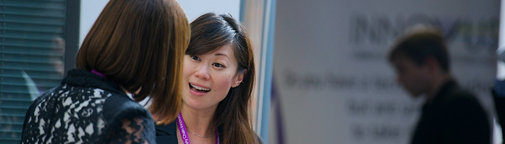

# Events for Employers {#events}
We host a range of events in Computer Science for employers to engage with.  

```{r business-fig, echo = FALSE, fig.align = "center", out.width = "100%", fig.cap = ""}

```


## Annual Computing Careers fair {#autumn}
Our annual Computer Science careers fair is held in the Nancy Rothwell Building in autumn, we typically have around 30 employers exhibiting over two days. As space is limited, we are always over-subscribed and are not able to accommodate every employer that our students will be interested in. We give priority to employers that offer internships, placements and graduate roles and have contributed to our community through the activities described on this page. The central careers service also organises:  

* the big careers fair every autumn, see the [events](https://www.careers.manchester.ac.uk/events/)
* a smaller careers fair in May
* hundreds of other employer events on campus during term time [@highfliers2024]

## Bespoke events {#bespoke}

bespoke events

## Guest lectures {#guests}

We have a limited number of scheduled guest lecture slots, these occur as see \@ref(guests)

## other fairs {#other}


## Careers fairs {#careersfairs}


## Drop-in sessions {#dropins}
If you aren't willing or able to exhibit at careers fairs, we also run ad-hoc drop-in sessions where employers can come in and set up a stand in the foyer to talk to computer science students informally on their way to and from lectures. These usually happen during lunch in [term time](https://www.manchester.ac.uk/discover/key-dates/). If you're interested in exhibiting at either of these events, please [contact the careers and placements officer Mabel Yau](#office).

