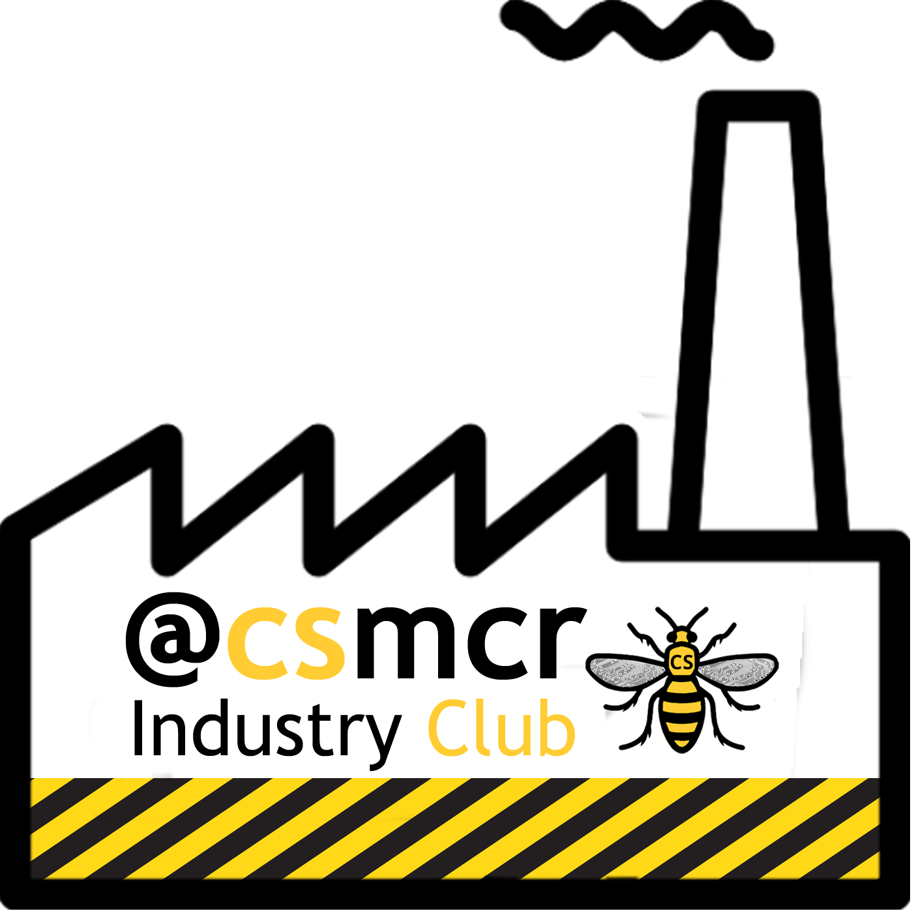

# Welcome to our Industry Club {-}

Hello and welcome to the Industry Club of the Department of Computer Science at the University of Manchester. 

## Industrial collaborations in Computer Science {#collabs}
Membership of this club is open to employers, supporters and alumni who:

* Recruit our students both those studying:
    + undergraduate Bachelors degrees and
    + postgraduate degrees, Masters and PhD
* Collaborate on research projects, see \@ref(research)
* Participate in a range of industrially focused teaching and research events organised or hosted by the Department, see section \@ref(events)


```{r echo = FALSE, fig.align = "center", out.width = "100%", fig.cap = "Any employer recruiting our students is welcome to join our industry club, see details below"}
knitr::include_graphics("images/industry-club-wide.png")
```


## Employers {#employers}
We work with a wide range of employers from the smallest bedroom startup to the worlds largest multi-national corporations, and are always looking for more organisations that can offer our students a stimulating working environment. According to [highfliers.co.uk](https://www.highfliers.co.uk), the University of Manchester is the most targeted University in the UK by the [Times Top 100 Graduate Employers](https://www.top100graduateemployers.com). [@times100; @highfliers2021; @highfliers2020; @Birchall2019] We can still do better, for example by engaging with a more diverse group of employers, especially those in Manchester and the [Northern Powerhouse](https://northernpowerhouse.gov.uk/), see [git.io/manc](https://git.io/manc). [@gitmanc; @londonvstherest; @hebdenbridge; @manhattanchester; @manchattan]


## Recruiting students {#recruiting}

If you are recruiting computer scientists and software engineers as a summer interns, placement students or as graduates please get in touch with me or [Mabel Yau](https://uk.linkedin.com/in/mabel-yau) (careers and placements officer). We typically have around 250 undergraduate students graduating annually, alongside a smaller number of Masters and PhD students. The [entry tariff](https://www.ucas.com/ucas/tariff-calculator) of our students (A* A* A* including mathematics) is comparable to other leading Computer Science (CS) departments in [Russell Group](https://en.wikipedia.org/wiki/Russell_Group) universities as shown in the table below.


Institute | UCAS entry tariff  
----------- | ----------- | --------
[University of Manchester](https://www.manchester.ac.uk/study/undergraduate/courses/2019/00560/bsc-computer-science/) | A* A* A*
[University of Cambridge](https://www.undergraduate.study.cam.ac.uk/courses/computer-science) | A* A* A
[University College London](https://www.ucl.ac.uk/prospective-students/undergraduate/degrees/computer-science-bsc/2020)| A* A* A
[Imperial College London](https://www.imperial.ac.uk/computing/prospective-students/courses/ug/beng-meng-computing/) | A* A* A
[University of Oxford](https://www.ox.ac.uk/admissions/undergraduate/courses-listing/computer-science) | A* A A

<!--
| CS Students per year
| ~100
| ~150
| ~200
| ~250
| ~50-->


If you are looking to recruit science and engineering students from other disciplines like [Physics](https://www.physics.manchester.ac.uk/), [Maths](https://www.maths.manchester.ac.uk/), [Chemistry](https://www.chemistry.manchester.ac.uk/), Mechnical, Aerospace & Civil Engineering ([MACE](https://www.mace.manchester.ac.uk/)), [Materials Science](https://www.materials.manchester.ac.uk/) and Electrical & Electronic Engineering ([EEE](https://www.eee.manchester.ac.uk/)) you should talk to:  

* academic staff in those departments and/or  
* the central careers service of the University via [employers.manchester.ac.uk](http://www.employers.manchester.ac.uk/)
* manchester.ac.uk/collaborate

<!--UPDATE THIS: A demographic breakdown of our students in Computer Science is show in Figure fig:pie-fig-->


## Industry Club {#industryclub}

```{r echo = FALSE, fig.align = "center", out.width = "40%"}

```

All employers are welcome to join our industry club mailing list by sending an email to listserv@listserv.manchester.ac.uk with the the text **subscribe cs-industryclub yourfirstname yoursecondname** in the body of the email message. The industry club is part of our [wider business engagement activities](https://www.cs.manchester.ac.uk/connect/business-engagement/).

The mailing list is low-traffic, typically two to three updates per year and an invitation to our annual industry club meeting. We promise not to spam you or sell your email details on to third parties.

## Industrial mentoring {#mentoring}
The [Industrial mentoring scheme for software engineers](https://www.cs.manchester.ac.uk/connect/business-engagement/industrial-mentoring/) allows employers meet students during code review sessions.


<!-- give an example project template -->


## Join the community

There is a thriving community of engineers and [entrepreneurs](https://www.accelerateme.co/) in Manchester and across the North of England. One of the best ways to recruit engineers and scientists is to join and _contribute_ to the community. Get involved in events, [sponsor a hackathon](https://www.unicsmcr.com/), deliver a guest lecture, host your own event or [become a software engineering mentor](https://www.cs.manchester.ac.uk/connect/business-engagement/industrial-mentoring/). Employers who engage **early and often** are much more likely to get something back. As an employer, you may also be interested in events run by:

* The [Institute of Student Employers](https://ise.org.uk/) (ISE)
* The [Association of Graduate Careers Advisory Services](https://www.agcas.org.uk) (AGCAS)
* The [Work Based and Placement Learning Association](https://www.asetonline.org) (ASET)

If you're a startup new to employment, you may find the guide at [gov.uk/employ-someone](https://www.gov.uk/employ-someone) useful.

## Buzzing!

At peak times, we can get **very busy** with many concurrent employer events on campus, see figure \@ref(fig:busy-fig). Please be patient and persistent if we do not reply immediately. Unfortunately, we are not always able to respond to everyone because our students, staff and space are all finite resources. We give priority to employers that have already given their time and expertise to our community.

(ref:captionhighfliers) According to [highfliers.co.uk](https://www.highfliers.co.uk), the University of Manchester is the most targeted University in the UK by the [Times Top 100 Graduate Employers](https://www.top100graduateemployers.com) [@highfliers2023]

```{r busy-fig, echo = FALSE, fig.align = "center", out.width = "100%", fig.cap='(ref:captionhighfliers)'}
knitr::include_graphics("images/high-fliers-table-2023.png")
```

## Employability

moved to recruitment

There's still more we can do to improve the employability of our graduates. If you'd like to help our graduates become more employable, [get in touch](contact).

